# kimura-neutral-theory-gaia

Gaia formalization of Kimura (1968) — Evolutionary Rate at the Molecular Level

<!-- badges:start -->
<!-- badges:end -->

## Overview

> [!TIP]
> **Reasoning graph information gain: `0.1 bits`**
>
> Total mutual information between leaf premises and exported conclusions — measures how much the reasoning structure reduces uncertainty about the results.

```mermaid
---
config:
  flowchart:
    rankSpacing: 80
    nodeSpacing: 30
---
graph TB
    haemoglobin_rate["Haemoglobin amino-acid substitution rate\n(0.92 → 0.96)"]:::premise
    cytochrome_c_rate["Cytochrome c substitution rate\n(0.90 → 0.94)"]:::premise
    triosephosphate_rate["Triosephosphate dehydrogenase substitution rate\n(0.85 → 0.91)"]:::premise
    selection_cannot_explain_rate["★ Selection alone cannot explain the observed substitution rate\n(0.50 → 0.95)"]:::exported
    neutral_theory_hypothesis["★ Neutral theory: most molecular substitutions are selectively neutral\n(0.50 → 0.47)"]:::exported
    selectionist_view["Selectionist view: substitutions driven by positive selection\n(0.50 → 0.29)"]:::premise
    neutral_fixation_probability["Fixation probability of a neutral allele is 1/(2Ne)\n(0.95 → 0.96)"]:::premise
    watson_mutation_rate["Watson's estimate of nucleotide misincorporation rate\n(0.80 → 0.80)"]:::premise
    cell_divisions_to_gamete["~50 cell divisions from zygote to gamete in humans\n(0.88 → 0.88)"]:::premise
    genetic_drift_importance["★ Random genetic drift must be recognized as important\n(0.50 → 0.66)"]:::exported
    not_both_views["not_both_views\n(0.95 → 1.00)"]:::premise
    strat_0(["infer\n0.11 bits"]):::weak
    cell_divisions_to_gamete --> strat_0
    neutral_fixation_probability --> strat_0
    neutral_theory_hypothesis --> strat_0
    watson_mutation_rate --> strat_0
    strat_0 --> genetic_drift_importance
    strat_1(["infer\n0.00 bits"]):::weak
    cytochrome_c_rate --> strat_1
    haemoglobin_rate --> strat_1
    neutral_fixation_probability --> strat_1
    neutral_theory_hypothesis --> strat_1
    selectionist_view --> strat_1
    triosephosphate_rate --> strat_1
    strat_1 --> selection_cannot_explain_rate
    oper_0{{"⊗"}}:::contra
    neutral_theory_hypothesis --- oper_0
    selectionist_view --- oper_0
    oper_0 --- not_both_views

    classDef premise fill:#ddeeff,stroke:#4488bb,color:#333
    classDef exported fill:#d4edda,stroke:#28a745,stroke-width:2px,color:#333
    classDef weak fill:#fff9c4,stroke:#f9a825,stroke-dasharray: 5 5,color:#333
    classDef contra fill:#ffebee,stroke:#c62828,color:#333
```

## Conclusions

| Label | Content | Prior | Belief |
|-------|---------|-------|--------|
| genetic_drift_importance | If the main conclusion is correct (that neutral or nearly neutral mutations a... | 0.50 | 0.66 |
| neutral_theory_hypothesis | Most mutations produced by nucleotide replacement are almost neutral in natur... | 0.50 | 0.47 |
| selection_cannot_explain_rate | The observed rate of nucleotide substitution (approximately one per two years... | 0.50 | 0.95 |

<!-- content:start -->
<!-- content:end -->
