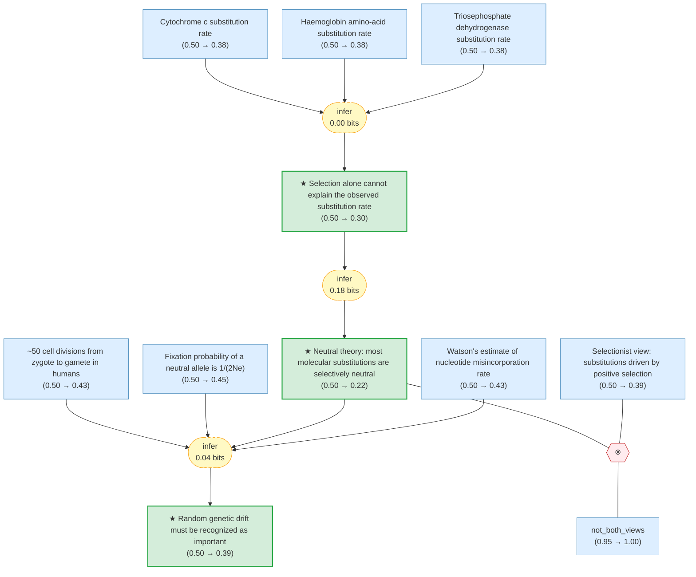

# kimura-neutral-theory-gaia

Add your description here

<!-- badges:start -->
<!-- badges:end -->

## Overview

> [!TIP]
> **Reasoning graph information gain: `0.2 bits`**
>
> Total mutual information between leaf premises and exported conclusions — measures how much the reasoning structure reduces uncertainty about the results.

## Conclusions

| Label | Content | Prior | Belief |
|-------|---------|-------|--------|
| genetic_drift_importance | If the main conclusion is correct (that neutral or nearly neutral mutations a... | 0.50 | 0.39 |
| neutral_theory_hypothesis | Most mutations produced by nucleotide replacement are almost neutral in natur... | 0.50 | 0.22 |
| selection_cannot_explain_rate | The observed rate of nucleotide substitution (approximately one per two years... | 0.50 | 0.30 |

<!-- content:start -->
<!-- content:end -->
