# Kimura (1968): Evolutionary Rate at the Molecular Level

> **Original work:** Motoo Kimura. "Evolutionary Rate at the Molecular Level." *Nature* 217, 624–626 (1968). doi:[10.1038/217624a0](https://doi.org/10.1038/217624a0)

> [!NOTE]
> This README is an AI-generated analysis based on a [Gaia](https://github.com/SiliconEinstein/Gaia) reasoning graph formalization of the original work. Belief values reflect the graph's probabilistic assessment of each claim's support, not the original author's confidence. See [ANALYSIS.md](ANALYSIS.md) for detailed verification results.

## Summary

In this landmark 1968 paper, Motoo Kimura calculated the genome-wide rate of nucleotide substitution in mammals by extrapolating from comparative protein sequence data (haemoglobin, cytochrome c, and triosephosphate dehydrogenase), arriving at approximately one substitution every two years across the entire mammalian genome (~4 × 10⁹ nucleotide pairs). He showed this rate exceeds Haldane's theoretical limit for natural selection by 2–3 orders of magnitude, concluding that most molecular substitutions must be selectively neutral — fixed by random genetic drift rather than positive selection. This paper founded the neutral theory of molecular evolution, one of the most important conceptual frameworks in population genetics. The reasoning graph strongly confirms the rate discrepancy (belief 0.95 for selection's failure to explain the rate) and correctly identifies the neutral theory as the better explanation (comparison belief ≈ 1.0), while reflecting that a single 3-page paper with three protein comparisons provides limited evidentiary weight for the hypothesis itself (belief 0.47).

## Overview

> [!TIP]
> **Reasoning graph information gain: `0.1 bits`**
>
> Total mutual information between leaf premises and exported conclusions — measures how much the reasoning structure reduces uncertainty about the results.

```mermaid
---
config:
  flowchart:
    rankSpacing: 80
    nodeSpacing: 30
---
graph TB
    haemoglobin_rate["Haemoglobin amino-acid substitution rate\n(0.92 → 0.96)"]:::premise
    cytochrome_c_rate["Cytochrome c substitution rate\n(0.90 → 0.94)"]:::premise
    triosephosphate_rate["Triosephosphate dehydrogenase substitution rate\n(0.85 → 0.91)"]:::premise
    selection_cannot_explain_rate["★ Selection alone cannot explain the observed substitution rate\n(0.50 → 0.95)"]:::exported
    neutral_theory_hypothesis["★ Neutral theory: most molecular substitutions are selectively neutral\n(0.50 → 0.47)"]:::exported
    selectionist_view["Selectionist view: substitutions driven by positive selection\n(0.50 → 0.29)"]:::premise
    neutral_fixation_probability["Fixation probability of a neutral allele is 1/(2Ne)\n(0.95 → 0.96)"]:::premise
    watson_mutation_rate["Watson's estimate of nucleotide misincorporation rate\n(0.80 → 0.80)"]:::premise
    cell_divisions_to_gamete["~50 cell divisions from zygote to gamete in humans\n(0.88 → 0.88)"]:::premise
    genetic_drift_importance["★ Random genetic drift must be recognized as important\n(0.50 → 0.66)"]:::exported
    not_both_views["not_both_views\n(0.95 → 1.00)"]:::premise
    strat_0(["infer\n0.11 bits"]):::weak
    cell_divisions_to_gamete --> strat_0
    neutral_fixation_probability --> strat_0
    neutral_theory_hypothesis --> strat_0
    watson_mutation_rate --> strat_0
    strat_0 --> genetic_drift_importance
    strat_1(["infer\n0.00 bits"]):::weak
    cytochrome_c_rate --> strat_1
    haemoglobin_rate --> strat_1
    neutral_fixation_probability --> strat_1
    neutral_theory_hypothesis --> strat_1
    selectionist_view --> strat_1
    triosephosphate_rate --> strat_1
    strat_1 --> selection_cannot_explain_rate
    oper_0{{"⊗"}}:::contra
    neutral_theory_hypothesis --- oper_0
    selectionist_view --- oper_0
    oper_0 --- not_both_views

    classDef premise fill:#ddeeff,stroke:#4488bb,color:#333
    classDef exported fill:#d4edda,stroke:#28a745,stroke-width:2px,color:#333
    classDef weak fill:#fff9c4,stroke:#f9a825,stroke-dasharray: 5 5,color:#333
    classDef contra fill:#ffebee,stroke:#c62828,color:#333
```

> [!NOTE]
> **[Per-module reasoning graphs with full claim details →](docs/detailed-reasoning.md)**
>
> 5 Mermaid diagrams (one per section) with every claim, strategy, and belief value.

## Reasoning Structure

### Natural selection alone cannot account for the observed rate of molecular evolution (belief: 0.95)

Kimura's argument begins with empirical data: comparative studies of three protein families across mammalian species yield amino-acid substitution rates of roughly one change per 7 × 10⁶ years (haemoglobin α and β chains, ~140 amino acids), one per 4.5 × 10⁷ years (cytochrome c, ~100 amino acids), and one per 2.8 × 10⁷ years (triosephosphate dehydrogenase, normalized to 100 amino acids). Averaging these gives approximately one amino-acid substitution per 2.8 × 10⁷ years for a 100-amino-acid chain. Extrapolating to the whole mammalian genome (4 × 10⁹ nucleotide pairs, with each amino acid coded by 3 nucleotides) yields a genome-wide nucleotide substitution rate of approximately one every two years. Haldane (1957) showed that the cost of natural selection limits gene substitution by positive selection to roughly one every 300 generations — far below one per two years. The discrepancy is 100–1,000-fold.

**Evidence support:**
- **Protein rate induction** (strongest support): Three independent protein families converge on a consistent order-of-magnitude substitution rate. The induction from haemoglobin (belief 0.96), cytochrome c (0.94), and triosephosphate dehydrogenase (0.91) drives the averaged rate to belief 0.999 — nearly certain given the well-established molecular data.
- **Genome extrapolation** (intermediate link, belief 0.999): Scaling from three coding proteins to the entire genome is well-supported because the calculation is straightforward arithmetic using known genome size and the triplet code.
- **Haldane's cost comparison** (belief 0.95): The comparison with Haldane's 300-generation limit is a direct consequence of the high genome-wide rate. The prior of 0.9 on this reasoning step reflects the robustness of the arithmetic.

> The rate discrepancy is overwhelmingly well-supported (belief 0.95). The v0.4.2 restructuring, which removed an unnecessary intermediate hop and reduced chain depth from 4 to 3, allows the strong empirical protein data to propagate efficiently to this conclusion.

### Most molecular substitutions are selectively neutral (belief: 0.47)

This is Kimura's central hypothesis: if selection cannot account for the observed substitution rate, then most substitutions must be selectively neutral — their fate determined by random genetic drift rather than natural selection. The neutral theory predicts that the substitution rate equals the mutation rate ($k = u$), independent of population size. This elegant result follows from the fixation probability of a neutral allele being $1/(2N_e)$ while the number of new neutral mutations per generation is $2N_e u$, so $k = 2N_e u \times 1/(2N_e) = u$.

The formalization models this as a competition between two explanations for the observed genome-wide substitution rate. The neutral theory predicts a rate matching the observation (~1 per 2 years), while the selectionist view predicts a rate 100–1,000× lower. The comparison claim reaches belief ≈ 1.0, reflecting the overwhelming quantitative superiority of the neutral prediction. The mutual exclusivity of the two views (contradiction, belief 1.0) creates appropriate coupling: as the selectionist view is pushed down to 0.29, the neutral theory benefits.

**Evidence support:**
- **Neutral vs. selectionist comparison** (comparison belief ≈ 1.0): The neutral theory's quantitative prediction of the substitution rate matches observation far better than the selectionist prediction — this is the strongest evidence in the package.
- **$k = u$ derivation** (deduction, belief 0.98): The mathematical derivation of the neutral substitution rate from the fixation probability is rigorous, yielding high belief.
- **Contradiction constraint** (belief 1.0): The mutual exclusivity of the neutral and selectionist views is well-modeled, creating appropriate coupling in the reasoning graph.
- **Heterozygosity prediction** (supporting evidence, belief 0.70): The neutral heterozygosity formula $H_e = 4N_e u/(4N_e u + 1)$ is consistent with Drosophila data (belief 0.78), providing independent corroboration.

> The neutral theory hypothesis receives belief 0.47, near its uninformative prior of 0.5. This reflects that while the evidence strongly favors it over selectionism, a single 3-page paper with limited data provides modest absolute evidentiary weight. The "explaining-away" effect — the genome-wide rate is already well-supported by empirical data alone — limits how much backward propagation from the comparison reaches the hypothesis.

### Random genetic drift must be recognized as a major force in molecular evolution (belief: 0.66)

Kimura argues that if neutral mutations are produced at a much higher rate than previously assumed (200–2,000 base-replacement mutations per generation, estimated from Watson's nucleotide misincorporation rate of 10⁻⁸–10⁻⁹ per replication × ~50 germ-line cell divisions × 4 × 10⁹ nucleotide pairs), then random genetic drift — not natural selection — is the dominant force shaping molecular evolution. This directly challenges the view, prevalent in the 1960s, that drift is negligible because population sizes are too large for stochastic effects to matter.

**Evidence support:**
- **Neutral theory + mutation rate consistency** (primary chain): The conclusion depends on the neutral theory hypothesis (belief 0.47) combined with the finding that the mutation rate is 100–1,000× above Haldane's limit (belief 0.82). The neutral theory hypothesis is the weaker input.
- **Mutation rate estimation** (secondary chain, belief 0.78): Watson's misincorporation rate × germ-line cell divisions gives 200–2,000 mutations per generation. Despite the order-of-magnitude uncertainty in Watson's estimate, the calculation is robustly supported.
- **Heterozygosity prediction** (supporting evidence, belief 0.70): The neutral heterozygosity formula is consistent with Drosophila data (belief 0.78), providing independent corroboration for the neutral theory's predictions about population structure.

> This conclusion achieves higher belief (0.66) than the neutral theory hypothesis itself (0.47) because it receives additional support through the independent mutation rate estimation pathway, partially bypassing the hypothesis's explaining-away limitation.

## Conclusions

| Conclusion | Belief | Key Evidence |
|------------|--------|-------------|
| Selection alone cannot explain the observed substitution rate | 0.95 | Three-protein induction → genome extrapolation → Haldane comparison |
| Most molecular substitutions are selectively neutral | 0.47 | Neutral vs. selectionist comparison (≈1.0) + contradiction constraint |
| Random genetic drift must be recognized as important | 0.66 | Neutral theory + mutation rate 100–1000× above selection limit |

<strong>Weak Points Analysis</strong>

The primary structural limitation is the **neutral theory hypothesis's explaining-away effect** (belief 0.47). The genome-wide substitution rate is already extremely well-supported by empirical protein data alone (belief 0.999), so the competing theoretical explanations for *why* the rate is high receive diminished backward propagation. This is a modeling artifact that accurately reflects a real phenomenon: strong empirical evidence is more informative about what the rate *is* than about *why* it is that high.

**Watson's nucleotide misincorporation estimate** (belief 0.80) spans a full order of magnitude (10⁻⁸ to 10⁻⁹ per nucleotide per replication). This uncertainty feeds into the mutation rate calculation (belief 0.78) and the neutral rate consistency argument (belief 0.82). A more precise measurement of the per-nucleotide mutation rate — achieved in later decades through direct sequencing — would substantially narrow the uncertainty bounds on the drift-importance conclusion.

**The protein sample size** is a structural concern: three proteins, however carefully chosen, may not represent the genome's diversity of evolutionary rates. Haemoglobin evolves relatively fast, cytochrome c very slowly, and triosephosphate dehydrogenase at an intermediate rate. Despite this, the induction from three independent observations achieves very high belief (0.999) for the averaged rate — any additional protein data would further strengthen what is already nearly certain.

**Haldane's cost principle** (modeled as a background setting, not subject to probabilistic updating) has been contested by population geneticists who argue that truncation selection, soft selection, or frequency-dependent selection can reduce the substitutional load. If the effective cost per substitution is lower than Haldane assumed, the gap between the observed rate and the selection limit narrows, weakening the core argument.

<strong>Evidence Gaps & Future Work</strong>

**Experimental gaps:**
- Direct measurement of the per-nucleotide per-generation mutation rate in mammals (achieved later via parent-offspring whole-genome sequencing) would replace Watson's order-of-magnitude estimate and sharpen the mutation rate calculation → neutral rate consistency → genetic drift importance chain.
- Substitution rate data from many more protein families (and non-coding regions) would further strengthen the already-robust induction (current belief 0.999 from three proteins).
- Quantitative measurement of heterozygosity across multiple species with independently estimated effective population sizes would test the neutral prediction $H_e = 4N_eu/(4N_eu + 1)$ more rigorously.

**Theoretical gaps:**
- The cost of natural selection under alternative selection models (soft selection, truncation selection) should be formalized as a competing explanation — currently Haldane's cost is an unquestionable setting, but its validity is part of the debate.
- The distinction between strictly neutral and nearly neutral mutations (later developed by Ohta, 1973) is not captured. Kimura uses "almost neutral" language but does not formalize what fitness effect threshold separates neutral from selected mutations.
- The relationship between amino-acid substitution rate and nucleotide substitution rate assumes a simple 3:1 codon mapping, ignoring synonymous vs. nonsynonymous substitutions — a distinction that later became central to molecular evolution analysis.

## Detailed Analysis

For structural integrity verification, standalone readability checks, and complete package statistics, see [ANALYSIS.md](ANALYSIS.md).
