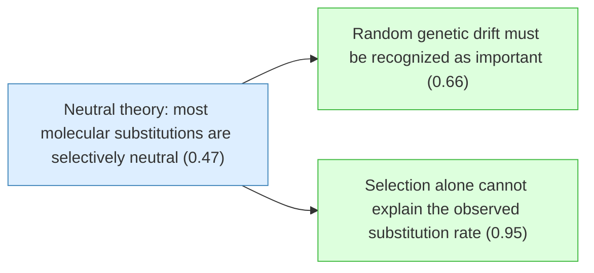
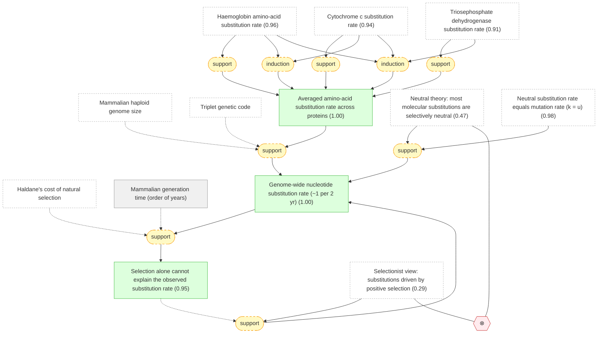
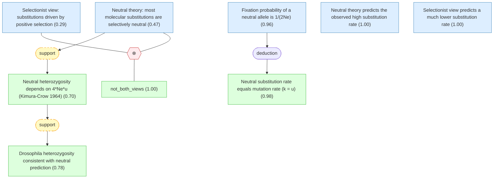
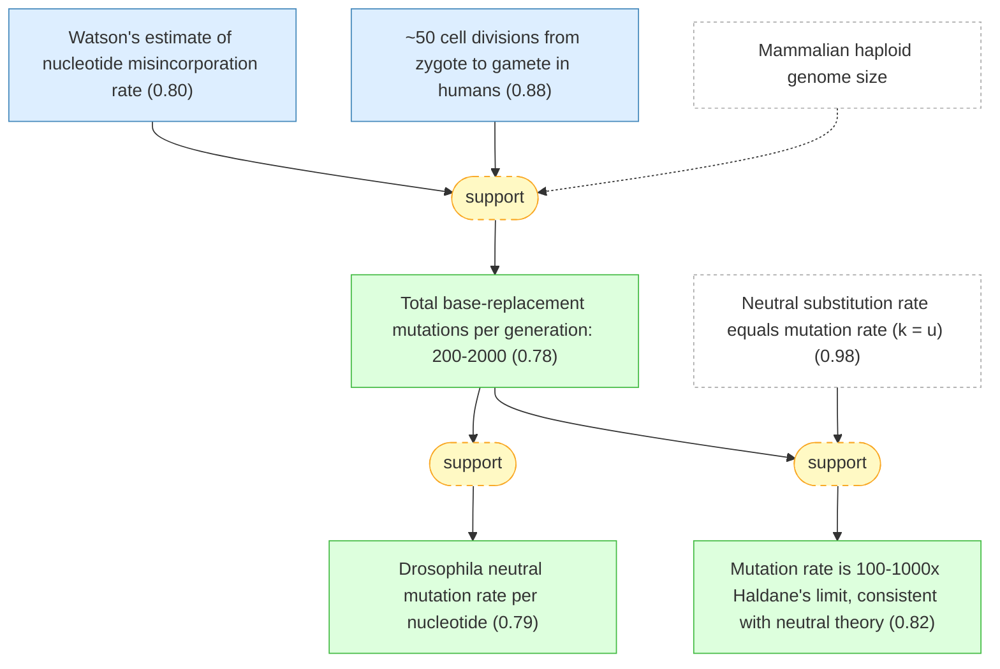
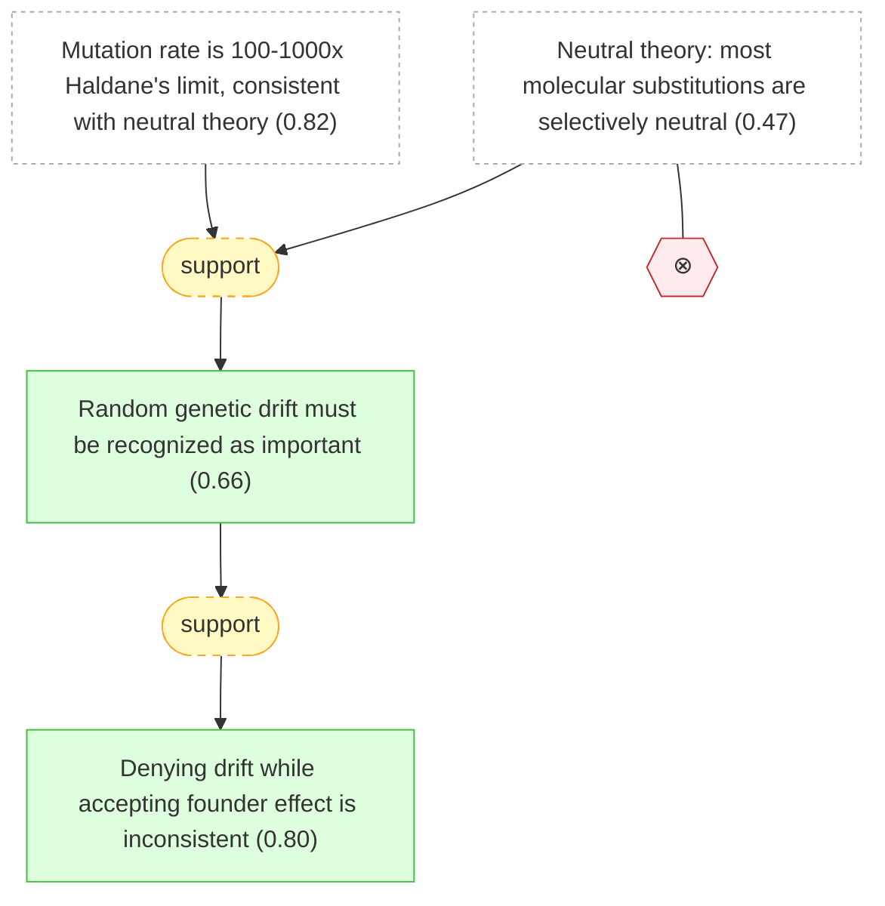

# kimura-neutral-theory-gaia

Gaia formalization of Kimura (1968) — Evolutionary Rate at the Molecular Level

## Overview

## Introduction: Observed Rates of Molecular Evolution

#### Mammalian haploid genome size

📋 `mammalian_genome_size`

> The haploid genome of mammals contains approximately $4 \times 10^9$ nucleotide pairs.

#### Triplet genetic code

📋 `genetic_code_triplet`

> Each amino acid is encoded by a triplet of three nucleotides (a codon) in the genetic code.

#### Haldane's cost of natural selection

📋 `haldane_cost_principle`

> Haldane (1957) showed that natural selection imposes a 'cost' on a population undergoing gene substitution: each substitution by natural selection requires a certain number of selective deaths (genetic deaths). This limits the rate at which gene substitutions can occur by natural selection to roughly one substitution every 300 generations.

#### Core question: selection vs neutrality

❓ `research_question`

> Can the observed rate of molecular evolution (nucleotide substitutions) be explained by natural selection alone, or must most substitutions be selectively neutral?

#### Haemoglobin amino-acid substitution rate

📌 `haemoglobin_rate`   |   Prior: 0.92   |   Belief: **0.96**

> Comparative studies of haemoglobin molecules among different groups of mammals suggest that amino-acid substitution has taken place roughly at the rate of one amino-acid change in $10^7$ years for a chain consisting of about 140 amino acids. For example, by comparing the $\alpha$ and $\beta$ chains of man with those of horse, pig, cattle and rabbit, the figure of one amino-acid change in $7 \times 10^6$ years was obtained (Zuckerkandl and Pauling, 1965).

#### Cytochrome c substitution rate

📌 `cytochrome_c_rate`   |   Prior: 0.90   |   Belief: **0.94**

> The rate of amino-acid substitution estimated by comparing gorilla and human cytochrome c (a chain of about 100 amino acids) turned out to be approximately one replacement in $4.5 \times 10^7$ years.

#### Triosephosphate dehydrogenase substitution rate

📌 `triosephosphate_rate`   |   Prior: 0.85   |   Belief: **0.91**

> Comparing triosephosphate dehydrogenase of rabbit with that of other species yields a figure of at least one amino-acid substitution for every $2.5 \times 10^7$ years for chains of about 1,110 amino acids. This figure is roughly equivalent to the rate of one amino-acid substitution in $2.8 \times 10^7$ years for a chain consisting of 100 amino acids.

#### DNA coding fraction estimate

📋 `dna_content_coding_fraction`

> The DNA content in terms of nucleotide pairs coding for amino acids is at most a few per cent of the total genome for higher organisms. Taking the equivalent of about $10^7$ nucleotide pairs as coding for amino acids (a polypeptide chain of 100 amino acids corresponds to 300 nucleotide pairs).

## Substitution Rate Calculation and Haldane's Cost Argument

#### Mammalian generation time (order of years)

📋 `mammalian_generation_time`

> For mammals, the average length of one generation varies by body size: roughly 1-2 years for small mammals (mice, rabbits) and up to 20-30 years for large mammals (humans, elephants). Kimura uses an order-of-magnitude figure of a few years for the illustrative calculation comparing molecular rates with Haldane's cost limit.

#### Averaged amino-acid substitution rate across proteins

📌 `normalized_aa_rate`   |   Belief: **1.00**

> Averaging figures for haemoglobin, cytochrome c, and triosephosphate dehydrogenase gives an evolutionary rate of approximately one amino-acid substitution in $28 \times 10^6$ years (i.e., $2.8 \times 10^7$ years) for a polypeptide chain of 100 amino acids.

🔗 **induction**([Haemoglobin amino-acid substitution rate](#haemoglobin_rate), [Cytochrome c substitution rate](#cytochrome_c_rate), [Triosephosphate dehydrogenase substitution rate](#triosephosphate_rate))

Reasoning

Triosephosphate dehydrogenase is independent of haemoglobin and cytochrome c.

#### Genome-wide nucleotide substitution rate (~1 per 2 yr)

📌 `genome_substitution_rate`   |   Belief: **1.00**

> Extrapolating from the averaged amino-acid substitution rate to the whole genome, and noting that a polypeptide of 100 amino acids is coded by 300 nucleotide pairs, the rate of nucleotide substitution per genome per year is estimated as:
> 
> $$k = \frac{1}{2.8 \times 10^7} \times \frac{4 \times 10^9}{3 \times 10^2} \approx \frac{1}{2}$$
> 
> That is, approximately one nucleotide pair substitution in the population every 2 years, or equivalently about one substitution every 1.8 years across the entire mammalian genome.

🔗 **support**([Selectionist view: substitutions driven by positive selection](#selectionist_view))

Reasoning

Under @selectionist_view, substitutions require positive selection. Haldane's cost argument limits positive selection to ~1 substitution per 300 generations. For mammals this is far below the observed rate of ~1 per 2 years, so the selectionist view poorly explains @genome_substitution_rate.

#### Selection alone cannot explain the observed substitution rate ★

📌 `selection_cannot_explain_rate`   |   Belief: **0.95**

> The observed rate of nucleotide substitution (approximately one per two years per mammalian genome) is so high that it cannot be accounted for by natural selection alone. Haldane (1957) showed that the cost of natural selection limits the rate of gene substitution by positive selection to roughly one every 300 generations. For mammals with generation times of a few years, 300 generations corresponds to hundreds to thousands of years. The observed molecular substitution rate is therefore 100-1,000 times higher than this limit, meaning most nucleotide substitutions in evolution must not have been driven by positive natural selection.

🔗 **support**([Genome-wide nucleotide substitution rate (~1 per 2 yr)](#genome_substitution_rate))

Reasoning

The genome-wide substitution rate (@genome_substitution_rate) of ~1 per 2 years vastly exceeds the limit imposed by Haldane's cost of natural selection. Haldane (1957) estimated that gene substitution by natural selection requires ~30 selective deaths per substitution, limiting the rate to ~1 gene substitution per 300 generations. For mammals with generation times of a few years, this translates to at most one substitution every several hundred years. The observed rate exceeds this limit by 2-3 orders of magnitude.

## The Neutral Theory: Hypothesis and Population Genetics

#### Neutral theory: most molecular substitutions are selectively neutral ★

📌 `neutral_theory_hypothesis`   |   Prior: 0.50   |   Belief: **0.47**

> Most mutations produced by nucleotide replacement are almost neutral in natural selection, meaning they have so little effect on the fitness of the organism that their fate in the population is determined primarily by random genetic drift rather than by selection. The very high rate of nucleotide substitution observed at the molecular level can be explained if most substitutions are the result of random fixation of selectively neutral or nearly neutral mutations.

#### Selectionist view: substitutions driven by positive selection

📌 `selectionist_view`   |   Prior: 0.50   |   Belief: **0.29**

> The conventional (selectionist) view holds that most molecular evolution is driven by positive natural selection: each amino-acid or nucleotide substitution that becomes fixed in a population does so because it confers a selective advantage. Under this view, the substitution rate is limited by Haldane's cost of natural selection.

#### not_both_views

📌 `not_both_views`   |   Prior: 0.95   |   Belief: **1.00**

> not_both_true(A, B)

#### Neutral substitution rate equals mutation rate (k = u)

📌 `neutral_substitution_formula`   |   Belief: **0.98**

> For neutral mutations, the rate of mutant substitution in the population (the rate at which new alleles become fixed) is:
> 
> $$k = u$$
> 
> where $u$ is the mutation rate per gamete per generation. This result holds because the probability that a new neutral mutation eventually becomes fixed in a population of effective size $N_e$ is $1/(2N_e)$, and the number of new neutral mutations appearing each generation is $2N_e u$. Multiplying these: $k = 2N_e u \times \frac{1}{2N_e} = u$. This is independent of population size.

🔗 **deduction**([Fixation probability of a neutral allele is 1/(2Ne)](#neutral_fixation_probability))

Reasoning

Starting from @neutral_fixation_probability ($p = 1/(2N_e)$ for a neutral mutation), the substitution rate is obtained by multiplying the fixation probability by the number of new mutations per generation ($2N_e u$): $k = 2N_e u \times 1/(2N_e) = u$. The population size cancels, yielding the result that the substitution rate equals the mutation rate.

#### Fixation probability of a neutral allele is 1/(2Ne)

📌 `neutral_fixation_probability`   |   Prior: 0.95   |   Belief: **0.96**

> For a selectively neutral mutation in a diploid population of effective size $N_e$, the probability of eventual fixation is $p = 1/(2N_e)$, which equals the initial frequency of the new allele if it appears as a single copy.

#### Neutral heterozygosity depends on 4*Ne*u (Kimura-Crow 1964)

📌 `heterozygosity_formula`   |   Belief: **0.70**

> Kimura and Crow (1964) showed that for neutral mutations, the probability that a randomly chosen individual is homozygous at a locus is $1/(4N_e u + 1)$, where $N_e$ is the effective population number and $u$ is the mutation rate per locus per generation. Therefore, the expected heterozygosity is:
> 
> $$H_e = \frac{4 N_e u}{4 N_e u + 1}$$
> 
> To attain a heterozygosity of at least $H_e = 0.12$, it is necessary that $N_e \geq 2{,}300$. For a higher heterozygosity such as $H_e = 0.35$, $N_e$ must be about $8{,}000$.

🔗 **support**([Neutral theory: most molecular substitutions are selectively neutral](#neutral_theory_hypothesis))

Reasoning

Under the neutral theory (@neutral_theory_hypothesis), most polymorphism is selectively neutral and maintained by the balance of mutation and drift. Kimura and Crow (1964) derived that for neutral alleles, expected heterozygosity is $H_e = 4N_e u / (4N_e u + 1)$, depending only on the product of effective population size and mutation rate.

#### Drosophila heterozygosity consistent with neutral prediction

📌 `drosophila_heterozygosity`   |   Belief: **0.78**

> For Drosophila, with migration between subgroups, heterozygosity of 35 per cent may be attained even if the effective population size $N_e$ is much smaller for each subgroup. This is consistent with the neutral theory's prediction that heterozygosity is maintained by the balance between neutral mutation and random genetic drift.

🔗 **support**([Neutral heterozygosity depends on 4*Ne*u (Kimura-Crow 1964)](#heterozygosity_formula))

Reasoning

The neutral heterozygosity formula (@heterozygosity_formula) predicts that Drosophila populations with moderate effective sizes and subdivision (migration between subgroups) can attain 35% heterozygosity. This is consistent with observed levels of protein polymorphism in Drosophila.

#### Neutral theory predicts the observed high substitution rate

📌 `neutral_predicts_rate`   |   Prior: 0.90   |   Belief: **1.00**

> Under the neutral theory, the substitution rate equals the mutation rate ($k = u$), which for mammals with ~$4 \times 10^9$ nucleotide pairs and error rates of $10^{-8}$ to $10^{-9}$ per nucleotide per replication, predicts a genome-wide substitution rate on the order of one per few years. This matches the observed rate of ~1 substitution per 2 years.

#### Selectionist view predicts a much lower substitution rate

📌 `selectionist_predicts_rate`   |   Prior: 0.85   |   Belief: **1.00**

> Under the selectionist view, the substitution rate is limited by Haldane's cost of natural selection to roughly one gene substitution every 300 generations. For mammals, this predicts a far lower rate than the observed ~1 substitution per 2 years, a discrepancy of 2-3 orders of magnitude.

## Mutation Rate Estimation and Comparison with Molecular Rates

#### Watson's estimate of nucleotide misincorporation rate

📌 `watson_mutation_rate`   |   Prior: 0.80   |   Belief: **0.80**

> From a consideration of the average energy of hydrogen bonds and from information on mutation of rIIA gene in phage T4, Watson (1965) obtained $10^{-8}$ to $10^{-9}$ as the average probability of error in the insertion of a new nucleotide during DNA replication.

#### ~50 cell divisions from zygote to gamete in humans

📌 `cell_divisions_to_gamete`   |   Prior: 0.88   |   Belief: **0.88**

> In man, the number of cell divisions along the germ line from the fertilized egg to a gamete is roughly 50.

#### Total base-replacement mutations per generation: 200-2000

📌 `mammalian_mutation_rate_per_nucleotide`   |   Belief: **0.78**

> The rate of mutation resulting from base replacement is estimated as $50 \times 10^{-8}$ to $50 \times 10^{-9}$ per nucleotide pair per generation (i.e., $5 \times 10^{-7}$ to $5 \times 10^{-8}$). With approximately $4 \times 10^9$ nucleotide pairs in the mammalian haploid genome, the total number of mutations resulting from base replacement per generation may amount to $200$ to $2{,}000$.

🔗 **support**([Watson's estimate of nucleotide misincorporation rate](#watson_mutation_rate), [~50 cell divisions from zygote to gamete in humans](#cell_divisions_to_gamete))

Reasoning

Watson's estimate of nucleotide misincorporation rate (@watson_mutation_rate) is $10^{-8}$ to $10^{-9}$ per nucleotide per replication. With approximately 50 cell divisions from zygote to gamete (@cell_divisions_to_gamete), the per-nucleotide per-generation mutation rate is $50 \times 10^{-8}$ to $50 \times 10^{-9}$. Multiplying by the genome size ($4 \times 10^9$ nucleotide pairs) yields 200-2,000 total base-replacement mutations per generation.

#### Drosophila neutral mutation rate per nucleotide

📌 `drosophila_mutation_rate`   |   Belief: **0.79**

> The mutation rate per nucleotide pair per generation in Drosophila is roughly ten times as high as in man (i.e., $u \approx 1.5 \times 10^{-7}$ rather than $u \approx 1.5 \times 10^{-8}$). Another consideration allows the supposition that $u \approx 1.5 \times 10^{-7}$ is probably appropriate for the neutral mutation rate of a cistron in Drosophila.

🔗 **support**([Total base-replacement mutations per generation: 200-2000](#mammalian_mutation_rate_per_nucleotide))

Reasoning

The mutation rate per nucleotide pair per generation in Drosophila is estimated to be roughly ten times as high as in man (@mammalian_mutation_rate_per_nucleotide), because the mutation rate per nucleotide pair per generation in Drosophila is roughly ten times that of man. This gives $u \approx 1.5 \times 10^{-7}$ per nucleotide per generation for Drosophila, compared to $u \approx 1.5 \times 10^{-8}$ in man.

#### Mutation rate is 100-1000x Haldane's limit, consistent with neutral theory

📌 `neutral_rate_consistency`   |   Belief: **0.82**

> The estimated total mutation rate per generation (200-2,000 base-replacement mutations) is 100-1,000 times larger than the rate of approximately 2 substitutions per generation allowed by Haldane's natural selection cost. This is consistent with the neutral theory's prediction that the mutation rate per nucleotide per generation directly determines the substitution rate ($k = u$), because neutral mutations fix at a rate equal to the mutation rate regardless of population size.

🔗 **support**([Total base-replacement mutations per generation: 200-2000](#mammalian_mutation_rate_per_nucleotide), [Neutral substitution rate equals mutation rate (k = u)](#neutral_substitution_formula))

Reasoning

The total mutation rate of 200-2,000 per generation (@mammalian_mutation_rate_per_nucleotide) is 100-1,000 times larger than Haldane's limit of ~2 substitutions per generation by natural selection. However, under the neutral substitution formula (@neutral_substitution_formula, $k = u$), the fixation rate equals the mutation rate regardless of population size. This means the high mutation rate directly predicts a high substitution rate, consistent with the observed molecular evolutionary rate.

## Conclusions: Implications for Genetic Drift and Population Genetics

#### Random genetic drift must be recognized as important ★

📌 `genetic_drift_importance`   |   Belief: **0.66**

> If the main conclusion is correct (that neutral or nearly neutral mutations are being produced in each generation at a much higher rate than has been considered before), then we must recognize the great importance of random genetic drift due to finite population number in forming the genetic structure of biological populations. The significance of random genetic drift has been depreciated during the past decade, influenced by the opinion that almost no mutations are neutral and that population sizes are usually so large that random sampling of gametes should be negligible.

🔗 **support**([Neutral theory: most molecular substitutions are selectively neutral](#neutral_theory_hypothesis), [Mutation rate is 100-1000x Haldane's limit, consistent with neutral theory](#neutral_rate_consistency))

Reasoning

If the neutral theory (@neutral_theory_hypothesis) is correct, then neutral mutations are produced at a much higher rate than previously assumed (@neutral_rate_consistency shows 200-2,000 mutations per generation, 100-1,000x above Haldane's limit). Since these neutral mutations fix by random drift, not selection, random genetic drift must be the dominant force shaping molecular evolution and maintaining polymorphism in populations. This contradicts the prevailing view that drift is negligible due to large population sizes.

#### Denying drift while accepting founder effect is inconsistent

📌 `founder_principle_inadequate`   |   Belief: **0.80**

> To emphasize the founder principle but deny the importance of random genetic drift due to finite population number is, in Kimura's opinion, rather similar to assuming a great flood to explain the formation of deep valleys but rejecting a gradual but long lasting process of erosion by water as insufficient to produce such a result.

🔗 **support**([Random genetic drift must be recognized as important](#genetic_drift_importance))

Reasoning

If random genetic drift is important for ongoing molecular evolution (@genetic_drift_importance), then it is logically inconsistent to accept the founder principle (which invokes drift in small founding populations) while simultaneously denying the importance of drift in normal populations of finite size. Both phenomena arise from the same stochastic sampling process.

## Inference Results

**BP converged:** True (2 iterations)

| Label | Type | Prior | Belief | Role |
|-------|------|-------|--------|------|
| [selectionist_view](#selectionist_view) | claim | 0.50 | 0.2871 | independent |
| [neutral_theory_hypothesis](#neutral_theory_hypothesis) | claim | 0.50 | 0.4651 | independent |
| [genetic_drift_importance](#genetic_drift_importance) | claim | — | 0.6629 | derived |
| [heterozygosity_formula](#heterozygosity_formula) | claim | — | 0.6973 | derived |
| [drosophila_heterozygosity](#drosophila_heterozygosity) | claim | — | 0.7783 | derived |
| [mammalian_mutation_rate_per_nucleotide](#mammalian_mutation_rate_per_nucleotide) | claim | — | 0.7809 | derived |
| [drosophila_mutation_rate](#drosophila_mutation_rate) | claim | — | 0.7922 | derived |
| [founder_principle_inadequate](#founder_principle_inadequate) | claim | — | 0.7977 | derived |
| [watson_mutation_rate](#watson_mutation_rate) | claim | 0.80 | 0.8000 | independent |
| [neutral_rate_consistency](#neutral_rate_consistency) | claim | — | 0.8230 | derived |
| [cell_divisions_to_gamete](#cell_divisions_to_gamete) | claim | 0.88 | 0.8800 | independent |
| [triosephosphate_rate](#triosephosphate_rate) | claim | 0.85 | 0.9145 | independent |
| [cytochrome_c_rate](#cytochrome_c_rate) | claim | 0.90 | 0.9443 | independent |
| [selection_cannot_explain_rate](#selection_cannot_explain_rate) | claim | — | 0.9486 | derived |
| [neutral_fixation_probability](#neutral_fixation_probability) | claim | 0.95 | 0.9552 | independent |
| [haemoglobin_rate](#haemoglobin_rate) | claim | 0.92 | 0.9559 | independent |
| [neutral_substitution_formula](#neutral_substitution_formula) | claim | — | 0.9759 | derived |
| [selectionist_predicts_rate](#selectionist_predicts_rate) | claim | 0.85 | 0.9986 | independent |
| [neutral_predicts_rate](#neutral_predicts_rate) | claim | 0.90 | 0.9988 | independent |
| [genome_substitution_rate](#genome_substitution_rate) | claim | — | 0.9989 | derived |
| [normalized_aa_rate](#normalized_aa_rate) | claim | — | 0.9992 | derived |
| [not_both_views](#not_both_views) | claim | 0.95 | 0.9995 | structural |
